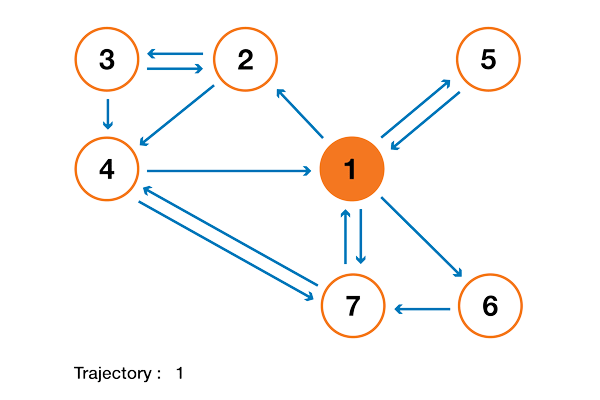
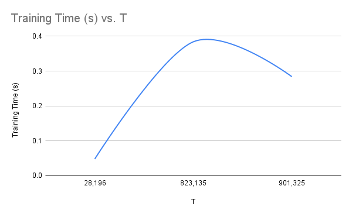
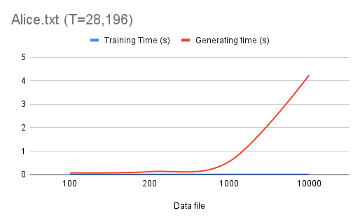
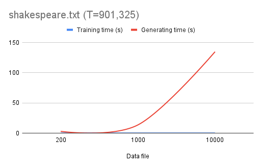
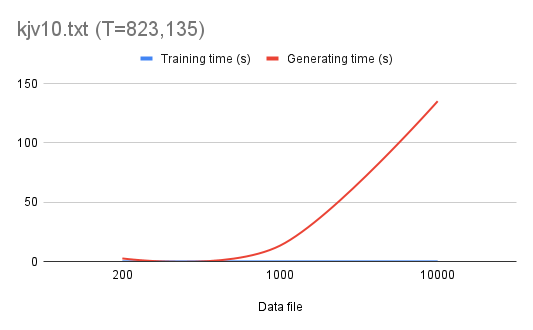
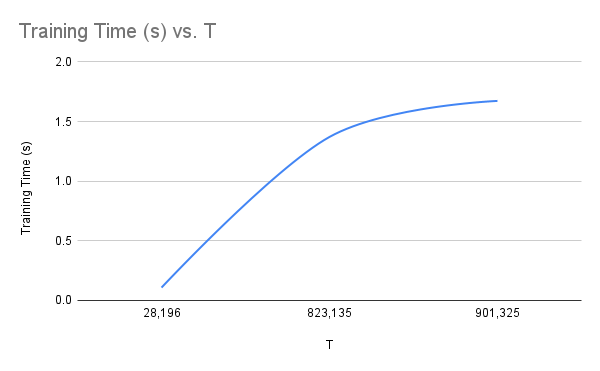
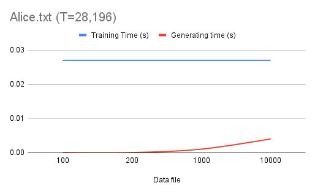
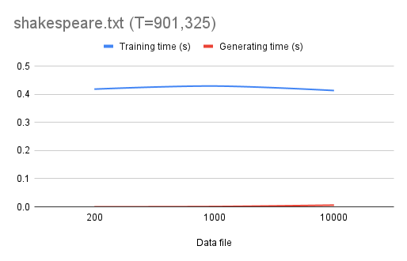
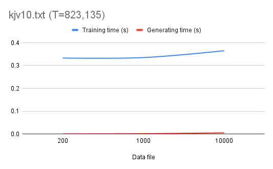

<!-- LOGO -->
<br />
<h1>
<p align="center">
  
  <br>Markov Algorithm Implementation
</h1>
  <p align="center">
    Example of implementation of the Markov Algorithm using efficient runtime complexity using the Java API and data structures. Based on HashMap and O(1) implementation. 
    <br />
    </p>
</p>
<p align="center">
  • <a href="#about-the-project">About The Project</a> •
  <a href="#Cloning">How To Use</a> •
  <a href="#Analysis">Runtime Analysis</a> •
  <a href="#Credits">Credits</a> •
</p>                                                                                                                             
                                                                                                                                                      
## About The Project
Computer science uses random Markov processes frequently to analyze many types of data. In this research, a generative model for producing text with a realistic appearance using data-driven techniques is examined in an occasionally comic approach.

Researchers studying artificial intelligence and machine learning in general, and those specializing in natural language processing (the application of algorithmic and statistical AI/ML techniques to human language), are particularly interested in generative models. The [OpenAI GPT-3](https://openai.com/blog/gpt-3-apps/) is a powerful and current example of such a text-generation model using statistical machine learning software.

### Wordgrams
Like a Java String represents a sequence of letters, WordGram represents a succession of words (expressed as strings). The WordGram class is an immutable sequence of strings, similar to how the Java String class is an immutable sequence of characters. An immutable WordGram object is one that cannot be changed once it has been created. A WordGram object's content cannot be altered. A new WordGram can be made from an existing one, though.

The order of a WordGram is occasionally referred to as the total number of strings it contains. To view some examples of order-3 WordGram objects, expand the section below.


<details>
<Summary>Example of order-3 Wordgrams</summary>

| | | |
| --- | --- | --- |
| "wanghley" | "soares" | "martins" |
| | | |

and 
| | | |
| --- | --- | --- |
| "Humans" | "are" | "destroying" |
| | | |

</details> 
<details>
<Summary>Example of order-5 Wordgrams</summary>

| | | |
| --- | --- | --- |
| "wanghley" | "soares" | "martins" | "is" | "crazy" |
| | | |

and 
| | | | | |
| --- | --- | --- | --- | --- |
| "Humans" | "are" | "destroying" | "the" | "planet" |
| | | | | |

</details> 


### Markov Model
Models with the Markov property are random models. In this instance, our goal is to develop a Markov model for generating random text that resembles training text. The Markov property in our context means that the probability for each subsequent word will be predicated on those of the preceding words. We shall produce one random word at a time.

When predicting text, an order-k Markov model uses order-k WordGrams, often known as k-grams (where k is the order). First, we choose a k-gram at random from the training text (the data we use to create our model; we want to generate random text similar to the training text). After that, we search for occurrences of that k-gram in the training text to determine the probabilities associated with possible next words. Then, using the final k-1 words from the prior k-gram and the newly formed word, we repeat the process, this time generating a new word in accordance with these probabilities. Continue in this manner until the necessary number of random words has been generated.

Read more about Markov Models and applications [HERE](http://dx.doi.org/10.1007/978-3-540-68947-8_8)

## Cloning

Import from GitHub:
```sh
git clone https://github.com/Wanghley/Markov-Algorithm
cd Markov-Algorithm
```

## Folder Structure

```bash
    Markov-Algorithm/
    ├── data
    ├── figures
    ├── lib
    ├── src/
    │   ├── BaseMarkov.java
    │   ├── HashMarkov.java
    │   ├── MarkovDriver.java
    │   ├── MarkovInterface.java
    │   ├── MarkovTest.java
    │   ├── TextSource.java
    │   ├── WordGram.java
    │   └── WordGramTest.java
    └── README.md
```

## Usage
In order to implement the following project you must use the ```MarkovDriver.java``` everytime you want to execute the code and generate a model by changing its constants of the order of the wordgram and the size of the output.

The ```BaseMarkov.java``` is the implementation without efficiency of the Markov algorithm while the ```HashMarkov.java``` is the implementation of HashMaps in the Markov algorithm and it is MORE efficient than the primer class.

The JUnit test is implemented in this project and, therefore, if you want to execute automatic tests in any adaptations of this code and of the WordGram class. YOu can use ```MarkovTest.java``` and     ```WordGramTest.java``` for testing Markov and WordGram, respectively.

## Analysis


For the analysis, "N" denote the length/number of words of the random text being generated. "T" denote the length/number of words of the training text. Assume that _all words are of at most a constant length_.

### BaseMarkov

```setTraining()``` is O(T), which is linear, since the line ```myWords =_text_.split("\\s+");``` is executed only once with complex O(T). Therefore, the complexity is linear of the setTraining method.

```getRandomText()``` is O(n²) for the following reasons:

```java
// Time Complexity: O(n²)

public String getRandomText(_int__length_){
  ArrayList\<String\> randomWords = **new** ArrayList\<\>(_length_); // 1, O(1)
  int index = myRandom.nextInt(myWords.length- myOrder +1); // 1, O(1)
  WordGram current = **new** WordGram(myWords,index,myOrder); // 1, O(1)
  randomWords.add(current.toString()); // 1, O(n)
  for(int k=0; k \<_length_-myOrder; k +=1) { // n, O(1)
    String nextWord =getNext(current); // n, O(n)
    randomWords.add(nextWord); // n, O(1)
    current = current.shiftAdd(nextWord); // n, O(1)
  }
  returnString.join("", randomWords); //1, O(1)
}
```
As it is possible to see, the getRandomText function is quadratic since the sum of the lines is, still, O(n²) complexity. The comments localized on the right side of each line indicates how many times the line is executed and the complexity of the line, respectively. Considering the worst scenario, the function getNext() has a time complexity O(n) executing n times, as follows:

```java
// Time Complexity: O(n)
private String getNext(WordGram_wgram_) {
  List\<String\> follows =getFollows(wgram); //1, O(n)
  if (follows.size() ==0) { //1, O(1)
    int randomIndex = myRandom.nextInt(myWords.length); //1, O(1)
    follows.add(myWords[randomIndex]); //1, O(N)
  }
  int randomIndex = myRandom.nextInt(follows.size()); //1, O(1)
  return follows.get(randomIndex); //1, O(1)
}
```

Experiment:

| **Data file** | **T** | **N** | **Training Time (s)** | **Generating time (s)** |
| --- | --- | --- | --- | --- |
| alice.txt | 28,196 | 100 | 0.012 | 0.076 |
| alice.txt | 28,196 | 200 | 0.012 | 0.125 |
| alice.txt | 28,196 | 1000 | 0.012 | 0.556 |
| alice.txt | 28,196 | 10000 | 0.012 | 4.236 |
| kjv10.txt | 823,135 | 100 | 0.096 | 1.413 |
| kjv10.txt | 823,135 | 200 | 0.096 | 2.582 |
| kjv10.txt | 823,135 | 1000 | 0.096 | 13.356 |
| kjv10.txt | 823,135 | 10000 | 0.096 | 135.080 |
| shakespeare.txt | 901,325 | 100 | 0.071 | 1.492 |
| shakespeare.txt | 901,325 | 200 | 0.071 | 2.941 |
| shakespeare.txt | 901,325 | 1000 | 0.071 | 13.556 |
| shakespeare.txt | 901,325 | 10000 | 0.071 | 134.721 |

```setTraining()``` behaviors almost as a linear function, however a strange behavior was perceptive for shakespeare which has T greater than kjv10. The graph of execution time x number of T is close to the following graph. 

This difference could occur due to the background execution on the process since the program was not set with high priority in its execution. It is possible to infer that it is a linear behavior overall for other points and data entries.

getRandomText() behaviored exactly as expected for a run time of O(n²). The comparison graphs can be found below, based on the table above. 

<p float="left">
  
   
  
</p>

### HashMarkov

```setTraining()``` is O(log(n)) due to the operation done within the for loop which executes myWords.length-myOrder (number of words - order of the wordgram). This is an amortized runtime complexity due to the behavior of the input which represents a logarithmic scale.

```java
public void setTraining(String text){
  super.myWords =_text_.split("\\s+"); // separates words by spaces or newlines
  map.clear(); // clears the map to avoid previous data used on other trainings
  WordGram tempWG; // variable to create WordGrams to populate map

  // Time Complexity: O(log(n))
  for (int i =0; i \< myWords.length-super.myOrder; i++) {
    tempWG = **new** WordGram(myWords, i, _super_.myOrder);
    map.putIfAbsent(tempWG, **new** ArrayList\<String\>());
    if (myWords.length==myOrder+i) {
      map.get(tempWG).add("");
    }
    else{
      map.get(tempWG).addAll(Arrays.asList(Arrays.copyOfRange(myWords, i+_super_.myOrder, i+_super_.myOrder+1))); // insert all following words to the hashmap of the given WordGram object
    }
  }
}
```

```getRandomText()``` is O(1) for the following reasons:

```java
// Time Complexity: O(1)

public String getRandomText(_int__length_){
  ArrayList\<String\> randomWords = **new** ArrayList\<\>(_length_); // 1, O(1)
  int index = myRandom.nextInt(myWords.length- myOrder +1); // 1, O(1)
  WordGram current = **new** WordGram(myWords,index,myOrder); // 1, O(1)
  randomWords.add(current.toString()); // 1, O(1)
  for(int k=0; k \<myWords.length-myOrder; k +=1) { // n, O(1)
    String nextWord =getNext(current); // n, O(1)
    randomWords.add(nextWord); // n, O(1)
    current = current.shiftAdd(nextWord); // n, O(1)
  }
  returnString.join("", randomWords); //1, O(1)
}
```

As it is possible to see, the ```getRandomText``` function is constant since the sum of the lines is, still, O(1) complexity. The comments localized on the right side of each line indicates how many times the line is executed and the complexity of the line, respectively. Considering the worst scenario, the function getNext() has a time complexity O(1) executing n times, as follows:

```java
// Time Complexity: O(1)

private String getNext(WordGram_wgram_) {
  List\<String\> follows =getFollows(wgram); **//1, O(1)**
  if (follows.size() ==0) { //1, O(1)
    int randomIndex = myRandom.nextInt(myWords.length); //1, O(1)
    follows.add(myWords[randomIndex]); //1, O(1)
  }
  int randomIndex = myRandom.nextInt(follows.size()); //1, O(1)
  return follows.get(randomIndex); //1, O(1)
}
```
The main advantage of the previous code is the use of the hashmap properties to reduce from O(n) complexity the interaction with the wordgrams to O(1), making it with linear operation time and making it very efficient in terms of runtime complexity.


**Experiment:**

| **Data file** | **T** | **N** | **Training Time (s)** | **Generating time (s)** |
| --- | --- | --- | --- | --- |
| alice.txt | 28,196 | 100 | 0.027 | 0.000 |
| alice.txt | 28,196 | 200 | 0.027 | 0.000 |
| alice.txt | 28,196 | 1000 | 0.027 | 0.001 |
| alice.txt | 28,196 | 10000 | 0.027 | 0.004 |
| kjv10.txt | 823,135 | 100 | 0.338 | 0.000 |
| kjv10.txt | 823,135 | 200 | 0.333 | 0.000 |
| kjv10.txt | 823,135 | 1000 | 0.335 | 0.001 |
| kjv10.txt | 823,135 | 10000 | 0.365 | 0.005 |
| shakespeare.txt | 901,325 | 100 | 0.413 | 0.000 |
| shakespeare.txt | 901,325 | 200 | 0.418 | 0.000 |
| shakespeare.txt | 901,325 | 1000 | 0.429 | 0.001 |
| shakespeare.txt | 901,325 | 10000 | 0.413 | 0.006 |



setTraining() behaviored almost as a logarithmic function (complexity O(log(n))).

getRandomText() behaviored exactly as expected for a run time of O(1). The comparison graphs can be found below, based on the table above.

<p float="left">
  
   
  
</p>

## Credits
- Credit to [Professor Brandon Fain](https://sites.duke.edu/btfain/) for the base Markov code used on this project.   
- Credit to [Joseph Rocca](https://medium.com/@joseph.rocca) for the descriptive gif of the Markov Algorithm used in the head of this document.